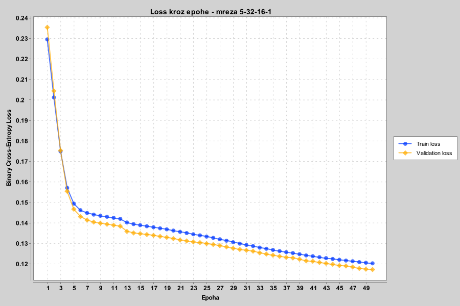

# Detekcija spam poruka pomoću Deep Netts biblioteke

Projekat binarne klasifikacije za prepoznavanje spam poruka korišćenjem potpuno povezane neuronske mreže implementirane u programskom jeziku **Java**, uz pomoć biblioteke **Deep Netts**.

U okviru projekta poređene su različite arhitekture neuronskih mreža, konačna konfiguracija je odabrana na osnovu rezultata na validacionom skupu, a zatim je izvršena evaluacija izabranog modela na prethodno neviđenom test skupu.

Pored evaluacionih metrika, prikazane su i vrednosti trening i validacionog loss-a kroz epohe.

---

## Opis projekta

Cilj projekta je predviđanje da li je određena poruka spam na osnovu pet numeričkih atributa:

- `num_links` — broj linkova u poruci
- `num_words` — broj reči u poruci
- `has_offer` — da li poruka sadrži ponudu
- `sender_score` — ocena pouzdanosti pošiljaoca
- `all_caps` — da li poruka sadrži tekst napisan velikim slovima

Ciljna promenljiva:

- `is_spam`
  - `1` — spam poruka
  - `0` — poruka nije spam

Skup podataka sadrži ukupno **20.000 poruka**.

---

## Podela skupa podataka

Skup podataka je podeljen na:

| Skup | Broj primera | Procenat |
|---|---:|---:|
| Trening skup | 14.000 | 70% |
| Validacioni skup | 3.000 | 15% |
| Test skup | 3.000 | 15% |

Nakon podele proverena je zastupljenost klasa i utvrđeno je da je procenat spam poruka približno jednak u trening, validacionom i test skupu.

Trening skup korišćen je za učenje parametara neuronske mreže.

Validacioni skup korišćen je za poređenje različitih arhitektura i izbor konačnog modela.

Test skup korišćen je samo za konačnu evaluaciju izabrane konfiguracije.

---

## Pretprocesiranje podataka

Vrednosti atributa normalizovane su korišćenjem klase `MinMaxScaler`.

Skaler je podešen isključivo na osnovu trening skupa, a zatim je primenjen na sva tri skupa.

Na ovaj način sprečeno je curenje informacija iz validacionog i test skupa u proces treniranja.

```java
MinMaxScaler scaler = new MinMaxScaler(trainSet);

scaler.apply(trainSet);
scaler.apply(validationSet);
scaler.apply(testSet);
```

---

## Konfiguracije neuronskih mreža

Trenirane su i upoređene tri različite arhitekture potpuno povezane neuronske mreže:

1. `5 → 32 → 16 → 1`
2. `5 → 16 → 1`
3. `5 → 64 → 32 → 1`

Broj `5` predstavlja pet ulaznih atributa, dok poslednji broj `1` predstavlja jedan izlazni neuron za binarnu klasifikaciju.

U skrivenim slojevima korišćena je **ReLU** aktivaciona funkcija.

U izlaznom sloju korišćena je **Sigmoid** aktivaciona funkcija, koja vraća vrednost između `0` i `1` i predstavlja procenjenu verovatnoću da je poruka spam.

Kao funkcija greške korišćena je **Cross-Entropy** funkcija, pogodna za binarnu klasifikaciju sa jednim sigmoidnim izlazom.

---

## Parametri treniranja

Sve tri arhitekture trenirane su korišćenjem istih parametara kako bi njihovo poređenje bilo što objektivnije.

| Parametar | Vrednost |
|---|---|
| Optimizacioni algoritam | SGD |
| Stopa učenja | 0.001 |
| Veličina batch-a | 64 |
| Broj epoha | 50 |
| Random seed | 42 |
| Early stopping | Isključen |
| Funkcija greške | Cross-Entropy |
| Izlazna aktivaciona funkcija | Sigmoid |

Primer podešavanja trenera:

```java
BackpropagationTrainer trainer = neuralNet.getTrainer();

trainer.setStopEpochs(50)
       .setStopError(0.000001f)
       .setLearningRate(0.001f)
       .setOptimizer(OptimizerType.SGD)
       .setBatchMode(true)
       .setBatchSize(64)
       .setEarlyStopping(false);
```

---

## Rezultati na validacionom skupu

Nakon treniranja, sve tri arhitekture evaluirane su na validacionom skupu.

| Arhitektura | Tačnost | Preciznost | Odziv | F1 mera |
|---|---:|---:|---:|---:|
| `5 → 32 → 16 → 1` | 95.57% | 77.74% | 75.86% | 76.79% |
| `5 → 16 → 1` | 94.20% | 79.00% | 54.48% | 64.49% |
| `5 → 64 → 32 → 1` | 95.63% | 77.70% | 76.90% | 77.30% |

Mreža `5 → 16 → 1` ostvarila je nešto veću preciznost, ali znatno lošiji odziv i F1 meru. To znači da je propuštala veći broj stvarnih spam poruka.

Najveća mreža `5 → 64 → 32 → 1` ostvarila je neznatno bolje rezultate od mreže `5 → 32 → 16 → 1`.

Ipak, kao konačna arhitektura izabrana je:

```text
5 → 32 → 16 → 1
```

Ova mreža ostvaruje gotovo identične rezultate kao veća mreža, dok koristi manji broj neurona i ima nižu računsku složenost.

Na taj način dobijen je dobar kompromis između performansi i složenosti modela.

---

## Konačni rezultati na test skupu

Izabrana mreža `5 → 32 → 16 → 1` evaluirana je samo jednom na prethodno neviđenom test skupu.

| Metrika | Rezultat |
|---|---:|
| Tačnost | **95.80%** |
| Preciznost | **77.32%** |
| Odziv | **76.19%** |
| F1 mera | **76.75%** |
| Specifičnost | **97.76%** |
| Stopa lažno pozitivnih primera | **2.24%** |
| Stopa lažno negativnih primera | **23.81%** |

Model je pravilno klasifikovao ukupno 95.80% poruka iz test skupa.

Visoka specifičnost pokazuje da model veoma dobro prepoznaje poruke koje nisu spam.

Preciznost od 77.32% znači da je približno 77% poruka koje je model označio kao spam zaista bilo spam.

Odziv od 76.19% znači da je model prepoznao približno 76% svih stvarnih spam poruka.

---

## Matrica konfuzije

Rezultati na test skupu:

|  | Predviđen spam | Predviđeno da nije spam |
|---|---:|---:|
| Stvarno spam | 208 | 65 |
| Stvarno nije spam | 61 | 2666 |

Vrednosti matrice konfuzije:

- True Positive: `208`
- True Negative: `2666`
- False Positive: `61`
- False Negative: `65`

Model je pravilno prepoznao 208 spam poruka i 2666 poruka koje nisu spam.

Pogrešno je označio 61 regularnu poruku kao spam, dok je 65 spam poruka klasifikovao kao poruke koje nisu spam.

---

## Primer predikcije

Istrenirana mreža može se koristiti kao binarni klasifikator za izračunavanje verovatnoće da je pojedinačna poruka spam.

```java
BinaryClassifier<float[]> binClassifier =
        new FeedForwardNetBinaryClassifier(neuralNet);

float[] testEmail =
        testSet.get(0).getInput().getValues();

Float result =
        binClassifier.classify(testEmail);

System.out.println(
        "Spam probability: " + result
);
```

Primer rezultata:

```text
Spam probability: 1.4150928E-4
```

Dobijena verovatnoća je veoma blizu nuli, pa je dati primer klasifikovan kao poruka koja nije spam.

---

## Loss grafikon

Vrednosti trening i validacionog Binary Cross-Entropy loss-a beležene su nakon svake epohe.



Loss vrednosti su se postepeno smanjivale tokom svih 50 epoha:

| Loss | Epoha 1 | Epoha 50 |
|---|---:|---:|
| Trening loss | 0.2295 | 0.1203 |
| Validacioni loss | 0.2354 | 0.1173 |

Trening loss se smanjio sa približno `0.2295` na `0.1203`.

Validacioni loss se smanjio sa približno `0.2354` na `0.1173`.

Obe krive ostaju veoma blizu i kontinuirano opadaju tokom treniranja.

Takvo ponašanje ukazuje na stabilan proces učenja bez očiglednih znakova preprilagođavanja u posmatranih 50 epoha.

Validacioni loss je na kraju nešto niži od trening loss-a. Razlika je mala i obe krive prate veoma sličan trend.

---

## Generisanje loss grafikona

Loss vrednosti su beležene nakon završetka svake epohe.

Za izračunavanje Binary Cross-Entropy loss-a korišćena je formula:

```text
Loss = -(y × log(p) + (1 - y) × log(1 - p))
```

gde je:

- `y` stvarna klasa
- `p` predviđena verovatnoća da je poruka spam

Grafikon je kreiran i sačuvan korišćenjem Java biblioteke **XChart**.

Kod za generisanje grafikona izdvojen je u posebnu klasu:

```text
LossChart.java
```

U glavnoj klasi grafikon se povezuje sa procesom treniranja jednom linijom koda:

```java
LossChart.attach(
        trainer,
        neuralNet,
        trainSet,
        validationSet
);
```

Nakon završetka treninga grafikon se prikazuje u posebnom prozoru i čuva kao:

```text
loss_curve.png
```

---

## Napomena o Deep Netts Visual AI Builder alatu

Postojao je pokušaj da se arhitektura mreže i proces treniranja vizualizuju korišćenjem alata **Deep Netts Visual AI Builder**.

Dostupni primer projekta za spam klasifikaciju napravljen je za stariju strukturu Deep Netts projekta i nije bio kompatibilan sa trenutnom verzijom Visual Workflow dodatka.

Prilikom povezivanja skupa podataka, konfiguracije treniranja i arhitekture mreže pojavljivale su se greške povezane sa `null` referencama.

Visual Workflow dodatak nije uspevao pravilno da pronađe training fajl, skup podataka i fajl sa arhitekturom mreže.

Zbog ovog tehničkog problema sa kompatibilnošću, loss grafikon je generisan programski korišćenjem biblioteke **XChart**.

Na ovaj način loss vrednosti se beleže direktno tokom treniranja stvarnog modela korišćenog u projektu, umesto korišćenja odvojenog eksperimenta u Visual AI Builder alatu.

---

## Struktura projekta

```text
CyberSecuritySpamDetectionDeepNetts/
│
├── datasets/
│   └── spam_detection_dataset.csv
│
├── src/
│   └── main/
│       └── java/
│           └── com/
│               └── nemanja/
│                   └── spam/
│                       ├── SpamClassifierDeepNetts.java
│                       └── LossChart.java
│
├── loss_curve.png
├── pom.xml
├── README.md
└── .gitignore
```

---

## Glavne klase

### `SpamClassifierDeepNetts.java`

Glavna klasa projekta zadužena je za:

- učitavanje skupa podataka;
- podelu na trening, validacioni i test skup;
- normalizaciju podataka;
- kreiranje arhitektura neuronskih mreža;
- podešavanje parametara treniranja;
- treniranje modela;
- evaluaciju na validacionom skupu;
- izbor konačne konfiguracije;
- evaluaciju na test skupu;
- predikciju pojedinačnog primera.

### `LossChart.java`

Pomoćna klasa zadužena je za:

- beleženje trening loss-a;
- beleženje validacionog loss-a;
- izračunavanje Binary Cross-Entropy loss-a;
- kreiranje loss grafikona;
- prikaz grafikona;
- čuvanje grafikona kao PNG fajla.

---

## Korišćene tehnologije

- Java 22
- Deep Netts 4.0.0-beta
- Maven
- NetBeans
- XChart
- Java Vector API incubator modul
- Git
- GitHub

---

## Maven zavisnosti

Za crtanje loss grafikona korišćena je biblioteka XChart.

```xml
<dependency>
    <groupId>org.knowm.xchart</groupId>
    <artifactId>xchart</artifactId>
    <version>4.0.2</version>
</dependency>
```

---

## Pokretanje projekta

Pošto Deep Netts koristi Java Vector API, prilikom pokretanja projekta potrebno je dodati sledeću VM opciju:

```text
--add-modules jdk.incubator.vector
```

Glavna klasa projekta je:

```text
com.nemanja.spam.SpamClassifierDeepNetts
```

Nakon pokretanja aplikacija:

1. učitava skup podataka;
2. deli podatke na trening, validacioni i test skup;
3. normalizuje vrednosti atributa;
4. kreira tri konfiguracije neuronskih mreža;
5. trenira sve tri konfiguracije;
6. poredi rezultate na validacionom skupu;
7. bira konačnu arhitekturu;
8. evaluira izabranu mrežu na test skupu;
9. izračunava verovatnoću da je pojedinačna poruka spam;
10. prikazuje i čuva loss grafikon.

---

## Zaključak

Rezultati pokazuju da neuronska mreža može uspešno da prepoznaje spam poruke na osnovu pet numeričkih atributa.

Izabrana arhitektura `5 → 32 → 16 → 1` ostvarila je tačnost od **95.80%** i F1 meru od **76.75%** na test skupu.

Poređenjem različitih arhitektura pokazano je da veća mreža ne mora nužno doneti značajno poboljšanje rezultata.

Izabrana mreža predstavlja dobar kompromis između performansi, složenosti i vremena izvršavanja.

Trening i validacioni loss kontinuirano su se smanjivali, bez očiglednog razdvajanja krivih, što ukazuje na stabilno treniranje modela.

---

